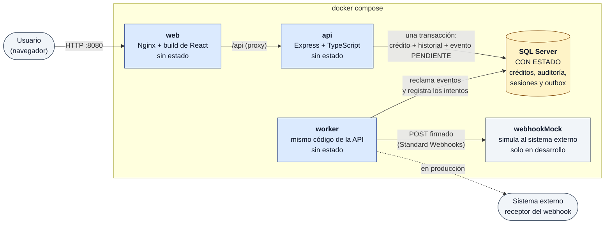
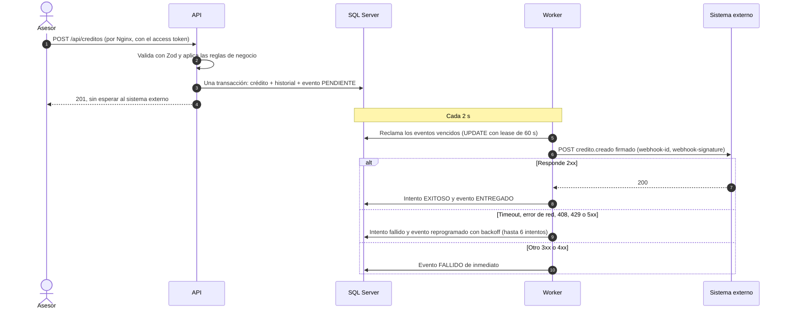

# Arquitectura

> Describe los componentes y la estructura decididos en los ADR 0001 a 0023. La propuesta de despliegue productivo está en [deploy.md](../03-operacion/deploy.md).

## 1. Contexto

Una entidad del sector financiero solidario administra las solicitudes de crédito de sus asociados: las registra, las consulta, actualiza su información y cambia su estado, y guarda un historial de esos cambios. Cada crédito creado se notifica a un sistema externo por webhook.

## 2. Componentes

| Componente | Tecnología | Rol | Estado |
|---|---|---|---|
| Frontend | React + Vite, servido por Nginx | Panel administrativo: dashboard, listado, creación y detalle, y para ADMIN usuarios y la traza del webhook. Llama a la API por el mismo origen (`/api`) ([ADR 0021](decisions/0021-frontend.md)) | Sin estado (archivos estáticos); el access token vive solo en memoria |
| API | Express + TypeScript (`server.ts`) | API REST, autenticación, validación y reglas de negocio | Sin estado; todo se guarda en la BD |
| Worker | El mismo código de la API (`worker.ts`), con su propia configuración | Envía los eventos del outbox al sistema externo, firmados y con reintentos. Escala horizontalmente: la BD reparte los eventos | Sin estado; los eventos y su traza están en la BD |
| SQL Server | SQL Server | Créditos, historial, usuarios, outbox y traza del webhook | **Con estado** |
| Mock receptor | Node.js (`node:http`) + la librería oficial de Standard Webhooks | Simula el sistema externo: verifica la firma, deduplica y falla a voluntad, con una página para cambiar el modo en vivo ([ADR 0020](decisions/0020-mock-del-sistema-externo.md)) | En memoria; se pierde al reiniciar |

Decisiones relacionadas: [ADR 0001](decisions/0001-monorepo-pnpm-workspaces.md) (repositorio y docker-compose), [ADR 0002](decisions/0002-express-typescript-react-vite.md) (stack), [ADR 0006](decisions/0006-webhook-outbox-transaccional.md) (worker y mock) y [ADR 0018](decisions/0018-webhook-entrega-firma-y-traza.md) (entrega, firma y traza).

**En Docker** ([ADR 0022](decisions/0022-docker-compose-y-empaquetado.md)), Nginx es la única entrada: sirve la web y reenvía `/api` a la API, con las cabeceras de seguridad y la CSP. La API, el worker y SQL Server quedan en la red interna (SQL Server se publica solo para herramientas de desarrollo). La API y el worker usan la misma imagen con otro comando, y un servicio de una sola vez crea la BD y otro los usuarios demo.

### Diagrama de componentes

Lo que levanta `docker compose up` ([ADR 0022](decisions/0022-docker-compose-y-empaquetado.md)). Los componentes **sin estado** se pueden reiniciar o replicar sin perder nada; **solo SQL Server guarda estado**.

### Diagrama de la creación de un crédito

El mismo requestId viaja de la petición al evento y al log del worker (sección 4).

## 3. Estructura del repositorio

Ver el árbol del [ADR 0001](decisions/0001-monorepo-pnpm-workspaces.md). La estructura interna de la API está en el [ADR 0004](decisions/0004-api-modular-por-capas.md).

## 4. Flujo de creación de un crédito

1. El frontend envía `POST /api/creditos` con el access token.
2. La API valida la entrada con el esquema Zod compartido ([ADR 0007](decisions/0007-zod-compartido-openapi-generado.md)) y el service aplica las reglas de negocio ([ADR 0004](decisions/0004-api-modular-por-capas.md)).
3. En una sola transacción se guardan el crédito y el evento `credito.creado` en estado `PENDIENTE`.
4. La API responde `201` sin esperar al sistema externo.
5. El worker toma el evento (hasta 2 s después), lo firma, lo envía y registra el intento. Si el envío falla por algo temporal, lo reprograma con backoff; si el receptor lo rechaza, o se agotan los intentos, queda `FALLIDO` ([ADR 0006](decisions/0006-webhook-outbox-transaccional.md), [ADR 0018](decisions/0018-webhook-entrega-firma-y-traza.md)).

Toda la operación comparte un mismo **requestId**: aparece en los logs de la API, se guarda con el evento del outbox, vuelve a aparecer en los logs del worker que lo entrega y le llega al receptor en `X-Request-Id`.

## 5. Trazabilidad

| Capa | Dónde vive | Qué registra |
|---|---|---|
| Logs técnicos | stdout en JSON (pino); en producción, un sistema central | Peticiones, errores y tiempos, correlacionados por requestId y sin datos personales completos |
| Auditoría de negocio | Tablas de la BD que solo admiten inserciones | Cambios de estado, cambios de datos del crédito y eventos de seguridad |
| Traza del webhook | Tablas del outbox y de los intentos en la BD | Cada evento, cada intento de envío y su resultado |

Decisión completa en el [ADR 0010](decisions/0010-logs-tecnicos-y-auditoria.md).

## 6. Datos y reglas

- El modelo de datos, con su diagrama entidad-relación, está en [modelo-datos.md](modelo-datos.md) ([ADR 0013](decisions/0013-modelo-de-datos.md)).
- La máquina de estados y las demás reglas de negocio están en el [ADR 0014](decisions/0014-reglas-de-negocio.md).

## Despliegue

Cómo se expondría en producción (HTTPS, secretos, backup, logs, health checks, monitoreo y CI/CD), con su diagrama y qué componentes son stateless y cuáles conservan estado: [deploy.md](../03-operacion/deploy.md).

Última actualización: 2026-10-01
