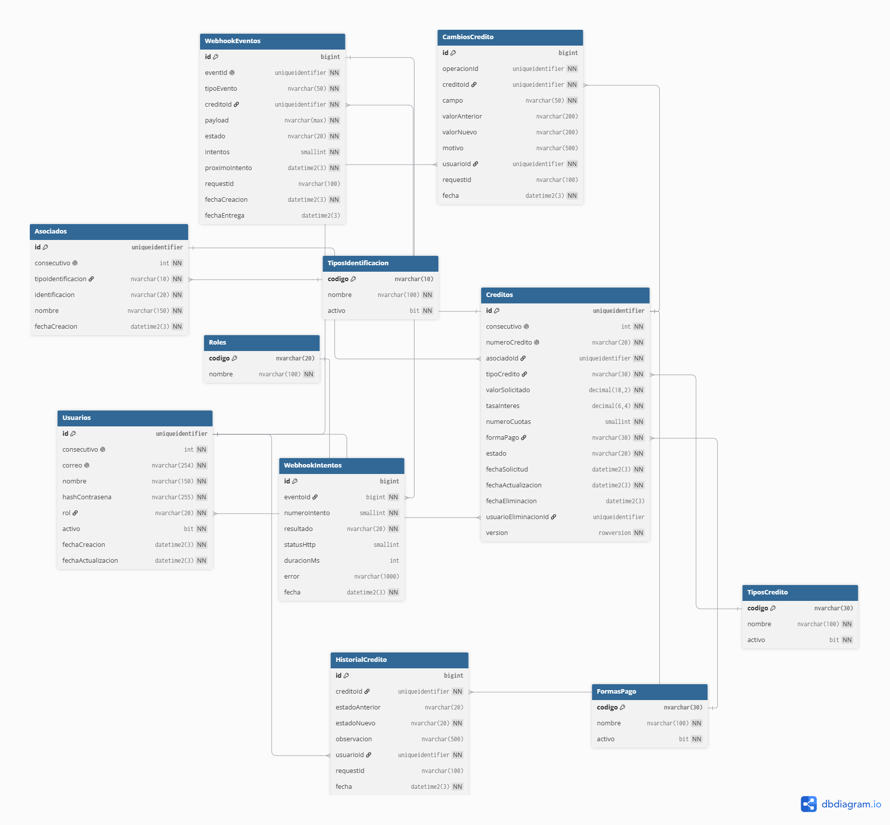

# Modelo de datos

Diccionario de datos de `ModuloCreditos` (SQL Server 2022). Justifica cada llave, índice, tipo, restricción, campo obligatorio, fecha y estado, como pide el enunciado. Las decisiones están en el [ADR 0013](decisions/0013-modelo-de-datos.md) y las reglas de negocio en el [ADR 0014](decisions/0014-reglas-de-negocio.md). El SQL fuente está en `database/` en la raíz del repositorio.

## Diagrama

Fuente del diagrama: [diagrams/modelo-datos.dbml](diagrams/modelo-datos.dbml). Para regenerarlo se pega en [dbdiagram.io](https://dbdiagram.io/d) y se exporta la imagen.

## Convenciones del esquema

| Elemento | Convención |
|---|---|
| Tablas | PascalCase, como en el enunciado (`Creditos`, `HistorialCredito`) |
| Columnas | camelCase, igual que los campos de la API |
| Restricciones e índices | Prefijo por tipo: `PK_`, `FK_`, `UX_` (único), `IX_` (índice), `CK_` (check), `DF_` (default), `TR_` (trigger), más la tabla y la columna o regla |
| Texto | `NVARCHAR`: Unicode, y del mismo tipo que los parámetros que envía el driver (sin conversiones implícitas que inutilicen índices) |
| Fechas | `DATETIME2(3)` en UTC, con `SYSUTCDATETIME()` como valor por defecto |
| Llaves foráneas | `NO ACTION`: no hay borrados físicos que propagar |
| Collation | `Modern_Spanish_CI_AI`: sin distinguir mayúsculas ni tildes, con orden alfabético español |

## Patrón de llaves de las entidades

`Usuarios`, `Asociados` y `Creditos` tienen dos identificadores:

| Columna | Tipo | Índice | Para qué |
|---|---|---|---|
| `id` | `UNIQUEIDENTIFIER DEFAULT NEWID()` | PK **nonclustered** | Identificador público: URL de la API, webhook y FKs. Aleatorio, así que no se puede enumerar |
| `consecutivo` | `INT IDENTITY` | `UNIQUE` **clustered** | Orden físico de la tabla: cada inserción va al final, sin *page splits*. Los índices secundarios cargan 4 bytes en lugar de 16 |

Un UUID aleatorio como clave clustered fragmentaría la tabla. Un UUID secuencial (`NEWSEQUENTIALID`) se puede adivinar. Y un UUIDv7 tampoco queda ordenado en SQL Server, porque el motor compara un `UNIQUEIDENTIFIER` empezando por sus últimos 6 bytes. El detalle está en el [ADR 0013](decisions/0013-modelo-de-datos.md).

Las tablas internas, que nunca se exponen por id y crecen varias filas por crédito, usan `BIGINT IDENTITY` como PK clustered.

## Catálogos

El código es la PK y es el mismo valor que viaja en la API, así que leer un crédito no exige joins. La columna `activo` permite retirar un valor para solicitudes nuevas sin borrarlo, porque los registros viejos lo siguen referenciando. Los datos se cargan con `003-catalogos.sql`.

| Tabla | Valores |
|---|---|
| `TiposIdentificacion` | CC (por defecto), CE, PA, PPT, NIT |
| `TiposCredito` | LIBRE_INVERSION, EDUCATIVO, VIVIENDA, VEHICULO, CALAMIDAD_DOMESTICA, ROTATIVO, COMPRA_CARTERA, EMPRENDIMIENTO |
| `FormasPago` | NOMINA, CAJA, DEBITO_AUTOMATICO, PSE |
| `Roles` | ASESOR, ANALISTA, TESORERIA, ADMIN |

Columnas: `codigo NVARCHAR(10|20|30)` PK, `nombre NVARCHAR(100)` obligatorio y `activo BIT DEFAULT 1` (salvo en `Roles`).

**El estado del crédito no es una tabla, es un `CHECK`**: está atado a la máquina de estados del código, y un estado nuevo exige código de todos modos.

## Usuarios

| Columna | Tipo | Nulo | Restricción / default | Justificación |
|---|---|---|---|---|
| `id`, `consecutivo` | — | No | Ver el patrón de llaves | — |
| `correo` | `NVARCHAR(254)` | No | `UX_Usuarios_correo` | Es el login. 254 es el máximo práctico de una dirección de correo |
| `nombre` | `NVARCHAR(150)` | No | `CK_Usuarios_nombre` (no vacío) | Se muestra en el historial |
| `hashContrasena` | `NVARCHAR(255)` | No | — | Nunca se guarda la contraseña. El algoritmo se define en el paso de autenticación |
| `rol` | `NVARCHAR(20)` | No | FK → `Roles` | Autorización por rol |
| `activo` | `BIT` | No | `DEFAULT 1` | Desactivar sin borrar: el historial lo sigue referenciando |
| `debeCambiarContrasena` | `BIT` | No | `DEFAULT 0` | La contraseña que asigna un ADMIN es temporal: hasta cambiarla, el usuario solo puede cambiarla ([ADR 0016](decisions/0016-autenticacion-sesiones-y-permisos.md)) |
| `fechaCreacion`, `fechaActualizacion` | `DATETIME2(3)` | No | `DEFAULT SYSUTCDATETIME()` | Trazabilidad |

## Sesiones

Una fila por login ([ADR 0016](decisions/0016-autenticacion-sesiones-y-permisos.md)). Cada petición autenticada verifica aquí que su sesión siga viva.

| Columna | Tipo | Nulo | Restricción / default | Justificación |
|---|---|---|---|---|
| `id` | `BIGINT IDENTITY` | No | PK clustered | Va en el access token (`sid`). No necesita ser secreto: el token está firmado |
| `usuarioId` | `UNIQUEIDENTIFIER` | No | FK → `Usuarios` | — |
| `fechaInicio` | `DATETIME2(3)` | No | `DEFAULT SYSUTCDATETIME()` | — |
| `fechaExpiracion` | `DATETIME2(3)` | No | `CK_Sesiones_expiracion` (> inicio) | 8 h desde el login. La rotación del refresh no la extiende |
| `fechaRevocacion`, `motivoRevocacion` | `DATETIME2(3)`, `NVARCHAR(30)` | Sí | `CK_Sesiones_revocacion` (van juntos), `CK_Sesiones_motivoRevocacion` | LOGOUT, REUTILIZACION, NUEVA_SESION, USUARIO_DESACTIVADO, ROL_CAMBIADO, CONTRASENA_CAMBIADA |
| `ip` | `NVARCHAR(45)` | No | — | 45 caracteres: cabe una IPv6 |
| `userAgent` | `NVARCHAR(300)` | Sí | — | — |

| Índice | Columnas | Por qué |
|---|---|---|
| `UX_Sesiones_activa` | (`usuarioId`) único, **filtrado** `WHERE fechaRevocacion IS NULL` | **Una sola sesión activa por usuario**, garantizada por la BD aun con dos logins simultáneos |

## RefreshTokens

| Columna | Tipo | Nulo | Restricción / default | Justificación |
|---|---|---|---|---|
| `id` | `BIGINT IDENTITY` | No | PK clustered | — |
| `sesionId` | `BIGINT` | No | FK → `Sesiones`, `IX_RefreshTokens_sesionId` | — |
| `hashToken` | `BINARY(32)` | No | `UX_RefreshTokens_hashToken` | **Solo el hash SHA-256**: con una copia de la BD no se pueden usar los tokens |
| `fechaCreacion` | `DATETIME2(3)` | No | `DEFAULT SYSUTCDATETIME()` | — |
| `fechaUso` | `DATETIME2(3)` | Sí | — | Cuándo se rotó. Un token usado que reaparece pasada la gracia de 10 s es señal de robo |
| `requestId` | `NVARCHAR(100)` | Sí | — | — |

## Asociados

| Columna | Tipo | Nulo | Restricción / default | Justificación |
|---|---|---|---|---|
| `id`, `consecutivo` | — | No | Ver el patrón de llaves | — |
| `tipoIdentificacion` | `NVARCHAR(10)` | No | FK → `TiposIdentificacion`, `DEFAULT 'CC'` | La unicidad real en Colombia es tipo + número |
| `identificacion` | `NVARCHAR(20)` | No | `CK_Asociados_identificacion` | Formato por tipo: CC y NIT solo dígitos (NIT sin dígito de verificación); CE, PA y PPT alfanuméricos; mínimo 3 caracteres. Usa la collation binaria para que los rangos sean ASCII estrictos (rechaza `³`, por ejemplo) |
| `nombre` | `NVARCHAR(150)` | No | `CK_Asociados_nombre` (no vacío) | Tildes y ñ |
| `fechaCreacion` | `DATETIME2(3)` | No | `DEFAULT SYSUTCDATETIME()` | — |

| Índice | Columnas | Por qué |
|---|---|---|
| `UX_Asociados_identificacion` | (`identificacion`, `tipoIdentificacion`) único | Un asociado por documento. `identificacion` va primero para que el filtro de la API por identificación, sin tipo, use el índice |

## Creditos

| Columna | Tipo | Nulo | Restricción / default | Justificación |
|---|---|---|---|---|
| `id`, `consecutivo` | — | No | Ver el patrón de llaves | `id` es el de la API y el webhook |
| `numeroCredito` | `NVARCHAR(20)` calculada `PERSISTED` | No | `UX_Creditos_numeroCredito` | `CR-{año en hora Colombia}-{consecutivo con 6 dígitos}`, por ejemplo `CR-2026-000123`. Calculada: no hay concurrencia que resolver ni forma de modificarla. El año usa `DATEADD(HOUR, -5, fechaSolicitud)`, exacto porque Colombia no tiene horario de verano |
| `asociadoId` | `UNIQUEIDENTIFIER` | No | FK → `Asociados` | Inmutable: `DENY UPDATE` por columna |
| `tipoCredito` | `NVARCHAR(30)` | No | FK → `TiposCredito` | Línea de crédito |
| `valorSolicitado` | `DECIMAL(18,2)` | No | `CK_Creditos_valorSolicitado` (> 0) | Dinero exacto. Nunca `float` |
| `tasaInteres` | `DECIMAL(6,4)` | No | `CK_Creditos_tasaInteres` (0–100) | **% mensual** (1.5000 = 1,5 % mes vencido). 4 decimales para tasas como 2,0833 % |
| `numeroCuotas` | `SMALLINT` | No | `CK_Creditos_numeroCuotas` (1–360) | Cuotas mensuales. 360 = 30 años (vivienda) |
| `formaPago` | `NVARCHAR(30)` | No | FK → `FormasPago` | — |
| `estado` | `NVARCHAR(20)` | No | `CK_Creditos_estado`, `DEFAULT 'SOLICITADO'` | Los 6 estados del enunciado. Las transiciones las controla el service ([ADR 0014](decisions/0014-reglas-de-negocio.md)) |
| `fechaSolicitud` | `DATETIME2(3)` | No | `DEFAULT SYSUTCDATETIME()` | La pone el servidor. Inmutable: `DENY UPDATE` por columna |
| `fechaActualizacion` | `DATETIME2(3)` | No | `DEFAULT SYSUTCDATETIME()` | El service la actualiza en cada UPDATE |
| `fechaEliminacion` | `DATETIME2(3)` | Sí | `CK_Creditos_eliminacion` | Borrado lógico (solo en SOLICITADO) |
| `usuarioEliminacionId` | `UNIQUEIDENTIFIER` | Sí | FK → `Usuarios`, `CK_Creditos_eliminacion` | Quién eliminó. Va siempre junto con `fechaEliminacion` |
| `version` | `ROWVERSION` | No | — | Concurrencia optimista: SQL Server la cambia en cada UPDATE |

| Índice | Columnas | Por qué |
|---|---|---|
| `UX_Creditos_enCurso` | (`asociadoId`, `tipoCredito`) único, **filtrado** `WHERE estado IN (SOLICITADO, EN_ESTUDIO, APROBADO) AND fechaEliminacion IS NULL` | Regla de duplicados garantizada por la BD, aun ante dos peticiones simultáneas |
| `IX_Creditos_estado_fechaSolicitud` | (`estado`, `fechaSolicitud DESC`) filtrado `WHERE fechaEliminacion IS NULL` | Listado filtrado por estado, lo más reciente primero |
| `IX_Creditos_fechaSolicitud` | (`fechaSolicitud DESC`) filtrado `WHERE fechaEliminacion IS NULL` | Listado por defecto |
| `IX_Creditos_asociadoId` | (`asociadoId`) | Créditos de un asociado (filtro por identificación) |

Los índices de listado son filtrados porque los créditos eliminados nunca se listan: así no ocupan espacio en ellos.

## HistorialCredito — inmutable

Cambios de estado, con las columnas que sugiere el enunciado.

| Columna | Tipo | Nulo | Restricción | Justificación |
|---|---|---|---|---|
| `id` | `BIGINT IDENTITY` | No | PK clustered | Interna |
| `creditoId` | `UNIQUEIDENTIFIER` | No | FK → `Creditos` | — |
| `estadoAnterior` | `NVARCHAR(20)` | Sí | `CK_HistorialCredito_estadoAnterior`, `CK_HistorialCredito_creacion` | NULL solo en la creación (NULL → SOLICITADO) |
| `estadoNuevo` | `NVARCHAR(20)` | No | `CK_HistorialCredito_estadoNuevo` | — |
| `observacion` | `NVARCHAR(500)` | Sí | `CK_HistorialCredito_observacion` | Obligatoria y no vacía en RECHAZADO y CANCELADO |
| `usuarioId` | `UNIQUEIDENTIFIER` | No | FK → `Usuarios` | Quién hizo el cambio |
| `requestId` | `NVARCHAR(100)` | Sí | — | Correlación con los logs ([ADR 0010](decisions/0010-logs-tecnicos-y-auditoria.md)) |
| `fecha` | `DATETIME2(3)` | No | `DEFAULT SYSUTCDATETIME()` | — |

Índice `IX_HistorialCredito_creditoId_fecha` (`creditoId`, `fecha`): el historial de un crédito, en orden.

## CambiosCredito — inmutable

Cambios de datos: una fila por campo modificado. El borrado lógico también se registra aquí.

| Columna | Tipo | Nulo | Restricción | Justificación |
|---|---|---|---|---|
| `id` | `BIGINT IDENTITY` | No | PK clustered | — |
| `operacionId` | `UNIQUEIDENTIFIER` | No | — | Agrupa los campos de una misma edición. Lo genera el service, porque el requestId lo puede enviar el cliente y no se garantiza que sea único |
| `creditoId` | `UNIQUEIDENTIFIER` | No | FK → `Creditos` | — |
| `campo` | `NVARCHAR(50)` | No | `CK_CambiosCredito_campo` | Solo los campos editables y `fechaEliminacion` |
| `valorAnterior`, `valorNuevo` | `NVARCHAR(200)` | Sí | — | Representación en texto del valor |
| `motivo` | `NVARCHAR(500)` | Sí | `CK_CambiosCredito_motivo` | Obligatorio y no vacío en el borrado lógico |
| `usuarioId` | `UNIQUEIDENTIFIER` | No | FK → `Usuarios` | — |
| `requestId` | `NVARCHAR(100)` | Sí | — | — |
| `fecha` | `DATETIME2(3)` | No | `DEFAULT SYSUTCDATETIME()` | — |

Índice `IX_CambiosCredito_creditoId_fecha` (`creditoId`, `fecha`).

## EventosSeguridad — inmutable

Sesiones, accesos denegados y gestión de usuarios ([ADR 0016](decisions/0016-autenticacion-sesiones-y-permisos.md)).

| Columna | Tipo | Nulo | Restricción | Justificación |
|---|---|---|---|---|
| `id` | `BIGINT IDENTITY` | No | PK clustered | — |
| `tipoEvento` | `NVARCHAR(30)` | No | `CK_EventosSeguridad_tipoEvento` | LOGIN_EXITOSO, LOGIN_FALLIDO, LOGOUT, REFRESH, REFRESH_REUTILIZADO, SESION_REEMPLAZADA, ACCESO_DENEGADO, USUARIO_CREADO, USUARIO_DESACTIVADO, USUARIO_ACTIVADO, USUARIO_ROL_CAMBIADO, CONTRASENA_CAMBIADA |
| `usuarioId` | `UNIQUEIDENTIFIER` | Sí | FK → `Usuarios` | Quién hizo la acción. NULL en un login fallido de un correo inexistente |
| `usuarioAfectadoId` | `UNIQUEIDENTIFIER` | Sí | FK → `Usuarios` | A quién se le hizo (gestión de usuarios) |
| `sesionId` | `BIGINT` | Sí | FK → `Sesiones` | — |
| `correoIntentado` | `NVARCHAR(254)` | Sí | — | Login fallido: la señal de un ataque de enumeración de cuentas |
| `ruta` | `NVARCHAR(200)` | Sí | — | Acceso denegado |
| `detalle` | `NVARCHAR(200)` | Sí | — | Qué cambió, p. ej. `ADMIN → ANALISTA` |
| `ip`, `userAgent`, `requestId`, `fecha` | — | — | — | Origen y momento |

Índices `IX_EventosSeguridad_usuarioId_fecha` y `IX_EventosSeguridad_tipoEvento_fecha`: la actividad de un usuario, o un tipo de evento, en orden.

## WebhookEventos — outbox

Se inserta en la misma transacción que el crédito ([ADR 0006](decisions/0006-webhook-outbox-transaccional.md)).

| Columna | Tipo | Nulo | Restricción / default | Justificación |
|---|---|---|---|---|
| `id` | `BIGINT IDENTITY` | No | PK clustered | — |
| `eventId` | `UNIQUEIDENTIFIER` | No | `UX_WebhookEventos_eventId` | Lo genera la API porque va dentro del payload. El receptor deduplica con él |
| `tipoEvento` | `NVARCHAR(50)` | No | `CK_WebhookEventos_tipoEvento` | Por ahora, solo `credito.creado` |
| `creditoId` | `UNIQUEIDENTIFIER` | No | FK → `Creditos` | — |
| `payload` | `NVARCHAR(MAX)` | No | `CK_WebhookEventos_payload` (`ISJSON`) | Snapshot exacto del cuerpo: cada reintento envía lo mismo |
| `estado` | `NVARCHAR(20)` | No | `CK_WebhookEventos_estado`, `DEFAULT 'PENDIENTE'` | PENDIENTE, ENTREGADO, FALLIDO |
| `intentos` | `SMALLINT` | No | `DEFAULT 0` | Se incrementa al reclamar el evento: es el `numeroIntento` del envío en curso ([ADR 0018](decisions/0018-webhook-entrega-firma-y-traza.md)) |
| `proximoIntento` | `DATETIME2(3)` | No | `DEFAULT SYSUTCDATETIME()` | Backoff exponencial. Al reclamar, se corre 60 s al futuro (lease): si el worker muere, el evento reaparece |
| `requestId` | `NVARCHAR(100)` | Sí | — | La petición que creó el crédito |
| `fechaCreacion` | `DATETIME2(3)` | No | `DEFAULT SYSUTCDATETIME()` | — |
| `fechaEntrega` | `DATETIME2(3)` | Sí | — | — |

Índice `IX_WebhookEventos_pendientes` (`proximoIntento`), filtrado `WHERE estado = 'PENDIENTE'`: es lo que lee el worker, y queda pequeño porque los entregados salen del índice.

## WebhookIntentos — inmutable

Traza de cada envío al sistema externo.

| Columna | Tipo | Nulo | Restricción | Justificación |
|---|---|---|---|---|
| `id` | `BIGINT IDENTITY` | No | PK clustered | — |
| `eventoId` | `BIGINT` | No | FK → `WebhookEventos` | — |
| `numeroIntento` | `SMALLINT` | No | `UX_WebhookIntentos_evento_numero` (con `eventoId`) | No puede haber dos intentos con el mismo número |
| `resultado` | `NVARCHAR(20)` | No | `CK_WebhookIntentos_resultado` | EXITOSO, ERROR_HTTP, TIMEOUT, ERROR_RED |
| `statusHttp` | `SMALLINT` | Sí | — | NULL si no hubo respuesta |
| `duracionMs` | `INT` | Sí | — | — |
| `error` | `NVARCHAR(1000)` | Sí | — | `TIMEOUT` y `ERROR_RED`: el error. `ERROR_HTTP`: los primeros 500 caracteres de la respuesta |
| `fecha` | `DATETIME2(3)` | No | `DEFAULT SYSUTCDATETIME()` | — |

## Seguridad en la base de datos

| Mecanismo | Qué hace |
|---|---|
| Login `appCreditos` | La API se conecta con él. Tiene `SELECT`, `INSERT` y `UPDATE` sobre `dbo` y **ningún `DELETE`**: todo borrado es lógico |
| `DENY UPDATE` | Sobre `HistorialCredito`, `CambiosCredito`, `WebhookIntentos` y `EventosSeguridad` |
| `DENY UPDATE` por columna | `Creditos (asociadoId, fechaSolicitud)` |
| Triggers `TR_*_inmutable` | `INSTEAD OF UPDATE, DELETE` en las cuatro tablas de auditoría: rechazan incluso a un administrador |
| Scripts | Corren con un login administrador aparte. La contraseña de `appCreditos` llega como variable de sqlcmd y no está en el repositorio |

## Acceso desde la API (Prisma)

Prisma introspecta `UX_Sesiones_activa` y `UX_Creditos_enCurso` como si fueran únicos en toda la tabla: el código no usa `findUnique` por esas columnas ni la relación `Usuarios → Sesiones`. Además, Prisma 7 no soporta parte de este esquema (`ROWVERSION`, columnas calculadas, `DEFAULT` con `N'...'`). **El esquema no se recorta para acomodar al ORM**: esas operaciones, en particular todas las escrituras de `Creditos`, van con SQL parametrizado. Detalle y pruebas en el [ADR 0003](decisions/0003-sql-primero-prisma-por-introspeccion.md).

## Verificación

El 2026-09-30 se ejecutaron los tres scripts sobre SQL Server 2022 CU27 y se probaron **35 casos conectado como `appCreditos`**, todos con el resultado esperado:

- rechazo de valores, tasas, cuotas, estados, tipos e identificaciones fuera de regla;
- la regla de duplicados, incluido que otro tipo de crédito sí se permite y que un crédito nuevo se permite tras rechazar el anterior;
- el año de `numeroCredito` en hora de Colombia (2027-01-01 03:00 UTC → `CR-2026-…`);
- la búsqueda sin tildes;
- las observaciones y los motivos obligatorios;
- `ROWVERSION` (un UPDATE con versión vieja no afecta filas);
- los permisos: no hay `UPDATE` ni `DELETE` sobre la auditoría, ni `DELETE` sobre los créditos.

Los triggers se probaron además como `sa`.

Última actualización: 2026-10-01
