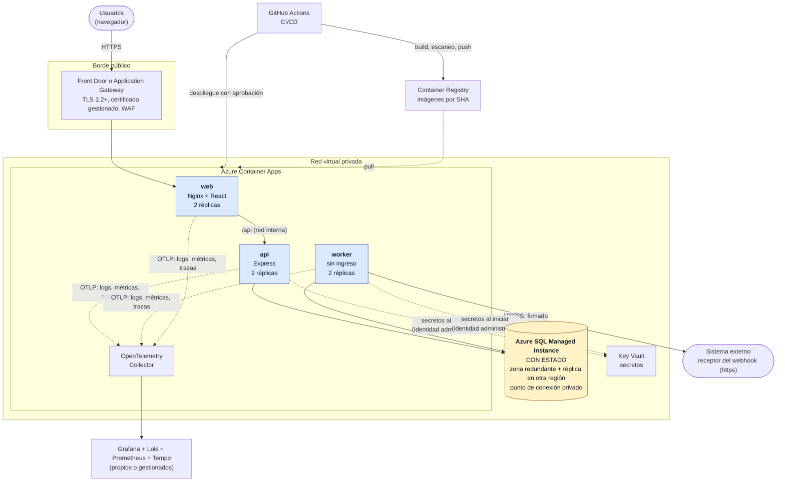

# Despliegue e infraestructura

Propuesta de cómo se expondría el Módulo de Créditos en producción, como pide la sección 16 del enunciado: **HTTPS, variables y secretos, backup de SQL Server, logs, health checks, monitoreo y CI/CD**, más qué componentes son stateless y cuáles conservan estado.

> **Es una propuesta, no un despliegue.** Lo que ya existe y está verificado es la imagen de cada servicio, el compose, los healthchecks, los logs en JSON con requestId y el apagado ordenado ([ADR 0022](../01-arquitectura/decisions/0022-docker-compose-y-empaquetado.md)). Lo demás (Azure, Key Vault, OpenTelemetry, el pipeline) se diseña aquí y **no se ejecutó**. La sección "Brechas conocidas" lista lo que el código necesita para llegar ahí.

## Supuestos

| | |
|---|---|
| Carga | Una entidad con unos 500 créditos al mes: un volumen pequeño, que no pide una arquitectura grande |
| Disponibilidad | Horario de operación de la entidad; una caída de minutos se tolera, la pérdida de datos no |
| Datos | Datos personales de los asociados (Ley 1581 de 2012) y auditoría financiera que no se puede perder ni alterar |
| Recuperación | **RPO de 5 minutos y RTO de 1 hora**, ante cualquier falla (sección "Backup y recuperación") |
| Plataforma | **Neutral, con Azure como referencia**: cada pieza se describe por su función y se mapea a un servicio de Azure. SQL Server es nativo en Azure, lo que hace la propuesta concreta sin atarla a un proveedor |

## Arquitectura de producción



El mapa de funciones a servicios:

| Función | Servicio de Azure | Alternativa neutral |
|---|---|---|
| Entrada pública, TLS y WAF | Front Door o Application Gateway | Cualquier balanceador L7 con certificados gestionados (Cloudflare, ALB, Traefik) |
| Contenedores (web, API y worker) | Azure Container Apps | Kubernetes, ECS, o una VM con Docker Compose en una entidad pequeña |
| Base de datos | Azure SQL Managed Instance | SQL Server en una VM con Always On |
| Secretos | Key Vault, con identidad administrada | HashiCorp Vault, AWS Secrets Manager |
| Imágenes | Container Registry | GHCR, ECR |
| Telemetría | OpenTelemetry Collector hacia Grafana, Loki, Prometheus y Tempo | El mismo stack en cualquier nube, o Azure Monitor |
| CI/CD | GitHub Actions (el repo está en GitHub) | Azure DevOps, GitLab CI |

**Por qué Managed Instance y no Azure SQL Database.** El script `001-crearBaseDatos.sql` crea un `LOGIN` a nivel de instancia y usa `USE`, algo que Azure SQL Database no admite. Managed Instance es la variante compatible con SQL Server completo: se espera que los scripts de `database/` corran sin cambios, y se verifica en el primer ambiente de pruebas.

**Por qué Container Apps.** Corre las mismas imágenes del compose, sin operar un clúster. Trae sondas de salud, secretos desde Key Vault, escala por réplicas y despliegue por revisiones con vuelta atrás. Para 500 créditos al mes, Kubernetes sería más de lo que se necesita.

## Qué es stateless y qué conserva estado

| Componente | Estado | Qué pasa si se reinicia o se replica |
|---|---|---|
| **web** (Nginx + build de React) | **Stateless**: archivos estáticos | Se replica sin límite. El access token vive solo en la memoria del navegador |
| **api** | **Stateless**: las sesiones, los créditos y la auditoría están en la BD | Se replica detrás del balanceador; cualquier réplica atiende cualquier petición. Solo guarda en memoria los contadores del rate limit, por réplica (ver "Brechas conocidas") |
| **worker** | **Stateless**: los eventos, su traza y el *lease* están en la BD | Se pueden correr varios: `UPDLOCK` + `READPAST` reparte los eventos sin que dos tomen el mismo ([ADR 0018](../01-arquitectura/decisions/0018-webhook-entrega-firma-y-traza.md)). Si muere a mitad de un envío, el *lease* de 60 s devuelve el evento |
| **SQL Server** | **Con estado**: créditos, historial, auditoría inmutable, usuarios, sesiones y el outbox con su traza | Es lo único que hay que respaldar y proteger |
| Key Vault, Registry y el almacén de telemetría | Con estado, **gestionados** | Los administra la plataforma; los secretos y las imágenes se pueden recrear desde el repositorio y el pipeline |
| Mock del webhook | En memoria | **No se despliega en producción**: el receptor es el sistema externo real |

## HTTPS

| Tramo | Cómo se protege |
|---|---|
| Navegador → borde | **TLS 1.2 como mínimo** (1.3 habilitado), certificado gestionado con renovación automática, redirección de http a https y **HSTS** de un año, que se agrega en el borde. El WAF corre en modo prevención con las reglas OWASP |
| Borde → web → API | Dentro de la red virtual privada, sin exposición pública. Si la política de la entidad lo exige, TLS mutuo entre servicios del entorno de Container Apps |
| API y worker → SQL Server | `encrypt=true` **sin** `trustServerCertificate`: el certificado de Managed Instance es de confianza. Punto de conexión privado y sin IP pública |
| Worker → sistema externo | **https obligatorio**: con `NODE_ENV=production` el worker no arranca con una `WEBHOOK_URL` http ([ADR 0018](../01-arquitectura/decisions/0018-webhook-entrega-firma-y-traza.md)). Además cada evento va firmado (HMAC-SHA256) |
| Cookie del refresh | Ya es `HttpOnly`, `Secure` y `SameSite=Strict` ([ADR 0016](../01-arquitectura/decisions/0016-autenticacion-sesiones-y-permisos.md)); con el sistema detrás de https, el flag `Secure` funciona como se diseñó |

La API ya envía sus propias cabeceras con Helmet, y Nginx envía la CSP y las demás para los archivos estáticos ([ADR 0022](../01-arquitectura/decisions/0022-docker-compose-y-empaquetado.md)). El borde agrega solo HSTS.

## Variables y secretos

**Principios.** Ningún secreto va en el repositorio, en una imagen ni en el pipeline como texto. Se guardan en **Key Vault** y cada servicio los lee al iniciar con su **identidad administrada**, que solo tiene acceso a los suyos (la API no ve el secreto del webhook; el worker no ve el `JWT_SECRET`). Las demás variables son configuración sin secretos y van en la definición del servicio.

| Variable | Producción | Secreto |
|---|---|---|
| `NODE_ENV` | `production` | No |
| `DATABASE_URL` | Login `appCreditos` (mínimo privilegio), con `encrypt=true` y sin `trustServerCertificate` | **Sí** |
| `JWT_SECRET` | 48 bytes aleatorios, solo la API | **Sí** |
| `WEBHOOK_SECRETO` | `whsec_` + 32 bytes, solo el worker; el receptor tiene el mismo | **Sí** |
| `WEBHOOK_URL` | https del sistema externo | No |
| `CORS_ORIGINS` | El origen público de la web (con el mismo origen, no se usa en la práctica) | No |
| `TRUST_PROXY` | El número de saltos hasta la API (borde, ingreso de Container Apps y Nginx). Se mide: la IP de `EventosSeguridad` tiene que ser la del cliente | No |
| `DOCS_HABILITADA` | `false`: no se publica el mapa de la API | No |
| `LOG_LEVEL` | `info` | No |
| `USUARIOS_DEMO_CLAVE` | **No existe en producción**: los usuarios demo no se crean | — |

**Rotación.**

- **`JWT_SECRET`**: es una sola clave HS256. Al rotarla, los access tokens vigentes (15 minutos) dejan de valer, la web recibe un 401 y renueva el token con el refresh (que vive en la BD y no depende de la clave): **el usuario no nota nada**. Queda un evento `ACCESO_DENEGADO` por cada token viejo, que se espera durante el cambio.
- **`WEBHOOK_SECRETO`**: se rota de forma coordinada con el receptor. Standard Webhooks permite que el receptor acepte dos secretos a la vez, pero el worker firma con uno solo: el receptor acepta ambos, se cambia el del worker, y después el receptor retira el viejo.
- **Clave de `appCreditos`**: se cambia en Key Vault y con `ALTER LOGIN`, y se reinician las réplicas de una en una.
- **Cuentas administradoras**: `sa` no se usa. Los cambios de esquema los hace una identidad aparte, que solo existe en el pipeline y nunca en la aplicación. `DATABASE_ADMIN_URL` (para `prisma db pull`) no existe en producción.

## Backup y recuperación de SQL Server

**Objetivo: RPO de 5 minutos y RTO de 1 hora.** Ningún mecanismo lo cumple solo: cada tipo de falla tiene el suyo.

| Falla | Mecanismo | RPO | RTO |
|---|---|---|---|
| Un nodo o una zona de disponibilidad de la BD | **Zona redundante** de Managed Instance: conmutación automática | 0 | Menos de 30 segundos |
| Una región completa | **Grupo de conmutación por error** hacia una instancia en otra región, con la réplica asíncrona y el *listener* que no cambia la cadena de conexión | Segundos (asíncrono: lo no replicado se pierde) | Menos de 1 minuto para conmutar, más la redirección del tráfico de la aplicación |
| Error humano, un defecto de la aplicación o corrupción | **Restauración a un punto en el tiempo (PITR)**: completo semanal, diferencial cada 12 o 24 horas y log cada 5 a 10 minutos, 35 días de retención. Se restaura a una BD nueva, justo antes del error | Hasta el instante elegido | Depende del tamaño: con una BD pequeña, minutos. **Se mide en la prueba de restauración**, no se asume |
| Pérdida de todo (la región y su réplica) | **Geo-restore** desde los backups geo-redundantes, que es el valor por defecto del servicio | Hasta 1 hora | Hasta 12 horas |

Los valores son los que publica Microsoft para [Managed Instance](https://learn.microsoft.com/en-us/azure/azure-sql/managed-instance/business-continuity-high-availability-disaster-recover-hadr-overview). **Los backups automáticos por sí solos dan un RPO de unos 10 minutos y un RTO que Microsoft cifra en "menos de 12 horas"**: para llegar a 5 minutos y 1 hora ante la caída de una zona o una región hace falta la zona redundante y el grupo de conmutación. Es el costo central de la propuesta: una segunda instancia en otra región, que se puede configurar como *standby* pasivo y sin licencia adicional de vCores (derechos de conmutación por error). Con 500 créditos al mes se puede arrancar solo con zona redundante y PITR, y sumar la segunda región cuando la entidad lo exija, aceptando mientras tanto el RPO de 1 hora y el RTO de 12 horas del geo-restore ante una caída regional.

**Retención de largo plazo (LTR).** Un completo mensual y uno anual durante el plazo que fije el control interno de la entidad (el servicio admite hasta 10 años). Los backups están cifrados en reposo con TDE, y las tablas de auditoría inmutables ([ADR 0013](../01-arquitectura/decisions/0013-modelo-de-datos.md)) viajan en ellos.

**Una copia no probada no es una copia.**

- **Restauración mensual** a una BD de pruebas, con `DBCC CHECKDB` y una consulta de conteos contra producción (créditos, historial y eventos de seguridad). Se registra cuánto tardó: ese es el RTO real.
- **Simulacro de conmutación por error** cada semestre, con el procedimiento escrito y los permisos del destino ya preparados (logins, reglas de red y alertas).

**Lo que el backup de la BD no cubre.** Los secretos (Key Vault tiene su propia recuperación y protección contra borrado), las imágenes (se reconstruyen desde el repositorio) y la configuración (está en el repositorio y en el pipeline).

**Después de restaurar a un punto anterior.** Los eventos del outbox que estaban `PENDIENTE` en ese punto se vuelven a enviar y el receptor puede recibir de nuevo uno que ya recibió: **la entrega es "al menos una vez"** y el receptor deduplica por `webhook-id` ([ADR 0018](../01-arquitectura/decisions/0018-webhook-entrega-firma-y-traza.md)). Los créditos y eventos creados después del punto restaurado se pierden juntos, así que no queda ningún evento huérfano. Hay que avisar al área de negocio qué ventana de operaciones hay que repetir.

**El volumen del compose no es un backup.** `sqlserverDatos` solo sirve para desarrollo.

## Logs

- **Qué se genera.** La API y el worker escriben **JSON a stdout** con pino, sin archivos ([ADR 0010](../01-arquitectura/decisions/0010-logs-tecnicos-y-auditoria.md)). Cada línea lleva el `requestId`, que viaja desde la petición hasta el evento del outbox y el log del worker que lo entrega, y llega al receptor en `X-Request-Id`.
- **Qué no se genera.** Contraseñas, tokens y cookies se eliminan; la identificación del asociado va enmascarada (`******4567`) y el nombre no se registra. Los logs se pueden centralizar sin exponer datos personales completos.
- **A dónde van.** La plataforma captura stdout y un agente (el OpenTelemetry Collector, o Grafana Alloy) los envía a **Loki**. Se busca por `requestId`, y desde un error que ve el usuario en la pantalla se llega a todo lo que pasó.
- **Cuánto se guardan.** Propuesta: 30 días consultables y 12 meses archivados, a ajustar con control interno. **La auditoría de negocio no vive en los logs**: está en la BD, en tablas que solo admiten inserciones, y sigue la retención de los backups.
- **Rotación en el contenedor.** El driver `json-file` rota a 10 MB y 3 archivos ([ADR 0022](../01-arquitectura/decisions/0022-docker-compose-y-empaquetado.md)); en Container Apps no aplica, porque la plataforma ya los envía fuera.

## Health checks

| Servicio | Sonda | Qué comprueba | Qué hace la plataforma |
|---|---|---|---|
| api | **Liveness** `GET /api/health` | El proceso responde. **No toca la BD**: una BD caída no debe reiniciar la API | Reinicia la réplica si falla |
| api | **Readiness** `GET /api/health/ready` | La API y la BD responden; si no, 503 | Saca la réplica del balanceador, sin reiniciarla; vuelve sola cuando la BD responde |
| api | **Startup** `GET /api/health` | Da tiempo a arrancar (valida la configuración y calcula el hash ficticio) antes de las otras sondas | No empieza a evaluar liveness ni readiness antes |
| worker | Latido: el ciclo toca `/tmp/latidoWorker` y la sonda exige menos de 60 s | El ciclo está vivo, aunque no haya eventos. Con la BD caída el ciclo sigue (registra el error y espera) | Reinicia la réplica si el ciclo se cuelga |
| web | `GET /` | Nginx sirve | Reinicia la réplica si falla |

El apagado ordenado está verificado en Linux: al detener el contenedor, la API deja de aceptar conexiones y espera las peticiones en curso, y el worker termina el lote que tiene y registra su resultado. El `stop_grace_period` (25 s para el worker, 15 s para la API) cubre el máximo que cada uno espera ([ADR 0022](../01-arquitectura/decisions/0022-docker-compose-y-empaquetado.md)). En Container Apps, el mismo valor va en `terminationGracePeriodSeconds`.

Una **sonda sintética externa** consulta `https://<dominio>/api/health/ready` cada minuto desde fuera de la red, y comprueba el camino completo: DNS, certificado, borde, Nginx, API y BD.

## Monitoreo

**Pila propuesta: OpenTelemetry y Grafana (Loki, Prometheus y Tempo).** Neutral al proveedor y con las tres señales correlacionadas: del log se salta a la traza con el `trace_id`, y de la traza a la consulta lenta en SQL Server.

> **Esto no está instrumentado hoy.** El código ya tiene los logs estructurados, el `requestId` y los health checks. Falta agregar el SDK de OpenTelemetry (`@opentelemetry/sdk-node` con las instrumentaciones de http, express y tedious, el driver de SQL Server) y la de pino, que agrega el `trace_id` a cada línea. Es un cambio de arranque, en `server.ts` y `worker.ts`, sin tocar los módulos.

| Señal | De dónde sale | Qué se mira |
|---|---|---|
| Métricas de la API | La instrumentación de http y express | Peticiones por segundo, errores 5xx y latencia p50 y p95 por ruta |
| Trazas | OpenTelemetry (API → BD) | Dónde se va el tiempo de una petición lenta |
| Cola del webhook | Una consulta periódica al outbox (un exportador SQL) | Eventos `PENDIENTE` vencidos y la edad del más viejo, y eventos `FALLIDO` |
| Seguridad | Los eventos de `EventosSeguridad` | Logins fallidos, accesos denegados y reúso de refresh |
| Contenedores | La plataforma | CPU, memoria, reinicios y estado de las sondas |
| SQL Server | Azure Monitor (o el exportador de SQL) | CPU, I/O, espacio libre, esperas, bloqueos y estado del último backup |
| Disponibilidad | La sonda sintética | El camino completo desde fuera |

**Alertas** (Grafana Alerting hacia el canal de guardia):

| Alerta | Condición | Severidad |
|---|---|---|
| API no disponible | La sonda externa falla 2 minutos seguidos | **Crítica** (avisa a la guardia) |
| Errores del servidor | 5xx por encima del 2 % durante 5 minutos | **Crítica** |
| Entrega del webhook detenida | El evento `PENDIENTE` más viejo supera 10 minutos, o el worker no tiene latido | **Crítica**: los créditos se guardan, pero nada se notifica |
| Eventos `FALLIDO` | Más de 0 en la última hora | Alta: revisar la traza (`/webhook`). No hay reenvío manual, por decisión ([ADR 0018](../01-arquitectura/decisions/0018-webhook-entrega-firma-y-traza.md)) |
| Latencia | p95 por encima de 1 s durante 10 minutos | Media |
| Ataque al login | Más de 50 logins fallidos o respuestas 429 en 10 minutos | Alta |
| Backup | Un backup falla o no se toma, o la prueba mensual no se hizo | Alta |
| BD | Espacio libre por debajo del 20 % o CPU por encima del 80 % sostenida | Media |
| Certificado | Vence en menos de 21 días (si la renovación automática falla) | Media |

## CI/CD

**CI en GitHub Actions**, en cada pull request y en cada cambio a `main`. Cada paso corresponde a un comando que ya existe y se corre igual en local.

| Etapa | Comando | Qué asegura |
|---|---|---|
| Instalar | `pnpm install --frozen-lockfile` | El lockfile manda: lo que se prueba es lo que se despliega |
| Formato | `pnpm format:check` | El estilo es uniforme |
| Lint | `pnpm lint` | ESLint con reglas con tipos, la convención de nombres y los hooks de React |
| Tipos | `pnpm typecheck` | TypeScript estricto en todos los paquetes |
| Pruebas | `pnpm test:coverage` | 233 pruebas (shared, unitarias de la API, integración contra **SQL Server real** y web), con cobertura |
| Imágenes | `docker build --target api` y `--target web` | Las imágenes se construyen igual que en producción |
| Escaneo | Trivy sobre cada imagen | Falla con vulnerabilidades altas o críticas con corrección disponible |
| Publicar | `docker push` al Registry, con la etiqueta del SHA del commit | Cada imagen es inmutable y rastreable a un commit |

**CD**, solo desde `main`:

1. **Esquema de BD** (cuando el cambio lo trae): los scripts SQL nuevos se aplican con la identidad administradora del pipeline, **antes** de las aplicaciones. Cada cambio es compatible hacia atrás (agregar y después retirar, nunca ambos en un mismo paso), para que la versión anterior siga funcionando mientras se despliega la nueva.
2. **Staging**, automático: se actualizan la API, el worker y la web a la nueva imagen, y corre una prueba de humo contra `/api/health/ready` y un login.
3. **Producción**, con **aprobación manual** de un responsable (el *environment* protegido de GitHub). Despliegue por revisiones: la nueva revisión recibe tráfico solo cuando su sonda de readiness pasa, y la anterior sigue activa hasta que la nueva está sana.
4. **Vuelta atrás**: si la prueba de humo o las alertas fallan, se reactiva la revisión anterior (segundos). Como el esquema es compatible hacia atrás, no hace falta tocar la BD.
5. **Autenticación sin secretos guardados**: GitHub se identifica ante Azure con **OIDC** (credenciales federadas), así que no hay claves de nube en el repositorio.

El workflow de referencia. **No se ejecutó**: no hay CI configurado en el repositorio, y se escribió con los comandos que sí se verificaron en local. Los *actions* se fijan por SHA al adoptarlo.

```yaml
# .github/workflows/ci.yml
name: ci

on:
  pull_request:
  push:
    branches: [main]

permissions:
  contents: read

concurrency:
  group: ci-${{ github.ref }}
  cancel-in-progress: true

jobs:
  verificar:
    runs-on: ubuntu-latest
    steps:
      - uses: actions/checkout@v4
      - uses: actions/setup-node@v4
        with:
          node-version-file: .nvmrc
      - run: npm install -g pnpm@12.8.1
      - run: pnpm install --frozen-lockfile
      - run: pnpm format:check
      - run: pnpm lint
      - run: pnpm typecheck
      # La integración usa SQL Server real. generarEnv crea el .env del compose con claves
      # aleatorias; las pruebas recrean ModuloCreditosPruebas con los scripts de database/.
      - name: Levantar SQL Server
        run: |
          node scripts/generarEnv.ts
          docker compose up -d --wait sqlserver
          clave=$(grep '^APP_DB_PASSWORD=' .env | cut -d= -f2-)
          echo "DATABASE_URL=sqlserver://localhost:1433;database=ModuloCreditos;user=appCreditos;password={${clave}};encrypt=true;trustServerCertificate=true" >> "$GITHUB_ENV"
      - run: pnpm test:coverage
      - uses: actions/upload-artifact@v4
        with:
          name: cobertura
          path: coverage/

  imagenes:
    needs: verificar
    if: github.ref == 'refs/heads/main'
    runs-on: ubuntu-latest
    permissions:
      contents: read
      id-token: write
    strategy:
      matrix:
        target: [api, web] # el worker usa la imagen de api; el mock no se despliega
    steps:
      - uses: actions/checkout@v4
      - uses: docker/setup-buildx-action@v3
      - uses: docker/build-push-action@v6
        with:
          context: .
          target: ${{ matrix.target }}
          load: true
          tags: modulo-creditos/${{ matrix.target }}:${{ github.sha }}
          cache-from: type=gha
          cache-to: type=gha,mode=max
      - uses: aquasecurity/trivy-action@master # fijar por SHA
        with:
          image-ref: modulo-creditos/${{ matrix.target }}:${{ github.sha }}
          severity: HIGH,CRITICAL
          ignore-unfixed: true
          exit-code: '1'
      - uses: azure/login@v2
        with:
          client-id: ${{ vars.AZURE_CLIENT_ID }}
          tenant-id: ${{ vars.AZURE_TENANT_ID }}
          subscription-id: ${{ vars.AZURE_SUBSCRIPTION_ID }}
      - name: Publicar en el Registry
        run: |
          az acr login --name ${{ vars.ACR_NOMBRE }}
          destino=${{ vars.ACR_NOMBRE }}.azurecr.io/modulo-creditos/${{ matrix.target }}:${{ github.sha }}
          docker tag modulo-creditos/${{ matrix.target }}:${{ github.sha }} "$destino"
          docker push "$destino"

  staging:
    needs: imagenes
    runs-on: ubuntu-latest
    environment: staging
    permissions:
      id-token: write
    steps:
      - uses: azure/login@v2
        with:
          client-id: ${{ vars.AZURE_CLIENT_ID }}
          tenant-id: ${{ vars.AZURE_TENANT_ID }}
          subscription-id: ${{ vars.AZURE_SUBSCRIPTION_ID }}
      # Aquí, antes de las apps: aplicar los scripts SQL nuevos con la identidad administradora.
      - name: Desplegar
        run: |
          imagen=${{ vars.ACR_NOMBRE }}.azurecr.io/modulo-creditos
          az containerapp update -g ${{ vars.GRUPO }} -n api    --image $imagen/api:${{ github.sha }}
          az containerapp update -g ${{ vars.GRUPO }} -n worker --image $imagen/api:${{ github.sha }}
          az containerapp update -g ${{ vars.GRUPO }} -n web    --image $imagen/web:${{ github.sha }}
      - name: Prueba de humo
        run: curl --fail --retry 10 --retry-delay 6 https://${{ vars.DOMINIO }}/api/health/ready

  produccion:
    needs: staging
    runs-on: ubuntu-latest
    environment: produccion # revisores obligatorios: la aprobación manual
    permissions:
      id-token: write
    steps:
      - uses: azure/login@v2
        with:
          client-id: ${{ vars.AZURE_CLIENT_ID }}
          tenant-id: ${{ vars.AZURE_TENANT_ID }}
          subscription-id: ${{ vars.AZURE_SUBSCRIPTION_ID }}
      - name: Desplegar
        run: |
          imagen=${{ vars.ACR_NOMBRE }}.azurecr.io/modulo-creditos
          az containerapp update -g ${{ vars.GRUPO }} -n api    --image $imagen/api:${{ github.sha }}
          az containerapp update -g ${{ vars.GRUPO }} -n worker --image $imagen/api:${{ github.sha }}
          az containerapp update -g ${{ vars.GRUPO }} -n web    --image $imagen/web:${{ github.sha }}
      - name: Prueba de humo
        run: curl --fail --retry 10 --retry-delay 6 https://${{ vars.DOMINIO }}/api/health/ready
```

**Actualización de dependencias e imágenes.** Dependabot propone cada semana las actualizaciones de las dependencias de pnpm, de las imágenes base del `Dockerfile` (que van con versión exacta) y de los *actions*; cada propuesta pasa por el mismo CI antes de entrar.

```yaml
# .github/dependabot.yml
version: 2
updates:
  - package-ecosystem: npm
    directory: /
    schedule: { interval: weekly }
  - package-ecosystem: docker
    directory: /
    schedule: { interval: weekly }
  - package-ecosystem: github-actions
    directory: /
    schedule: { interval: weekly }
```

## Del compose a producción: qué cambia

| | Compose (evaluación local) | Producción |
|---|---|---|
| Entrada | Nginx en el puerto 8080, http | Borde con TLS y WAF, y Nginx detrás |
| `NODE_ENV` | `development` (el webhook va por http al mock) | `production` (https obligatorio) |
| Base de datos | SQL Server Developer en un contenedor, con un volumen | Managed Instance, zona redundante, backups y réplica en otra región |
| Certificado de SQL Server | Autofirmado, con `trustServerCertificate=true` | De confianza, sin esa opción |
| Secretos | `.env` generado con claves aleatorias | Key Vault con identidad administrada |
| Réplicas | Una de cada | Dos o más de la API, el worker y la web |
| Swagger | Habilitado | Deshabilitado (`DOCS_HABILITADA=false`) |
| Usuarios demo y mock | Se crean y se levantan | **No existen** |
| Logs y métricas | `docker compose logs` | OpenTelemetry hacia Grafana |
| Despliegue | `docker compose up -d --build` | Pipeline con aprobación y vuelta atrás |

## Brechas conocidas

Lo que el código necesita para llegar a producción y que **no está hecho**:

1. **El primer administrador.** Hoy solo existe el script de los usuarios demo (contraseña compartida y dominio `.test`). En producción hace falta un alta única y auditada del primer ADMIN (con contraseña temporal), y los demás usuarios los crea él desde la pantalla de usuarios.
2. **Migraciones de esquema.** `database/` tiene scripts de creación, no migraciones versionadas. Para cambios posteriores se propone numerar los scripts (`004-…`) y registrar cuál se aplicó en una tabla de control, o usar una herramienta como Flyway. Es el paso 1 del CD.
3. **Instrumentación de OpenTelemetry**, descrita en "Monitoreo".
4. **El rate limit guarda sus contadores en la memoria de cada réplica** ([ADR 0016](../01-arquitectura/decisions/0016-autenticacion-sesiones-y-permisos.md)). Con dos réplicas, **todos** los límites se multiplican por dos, incluido el de 5 intentos fallidos de login por IP y correo. La fuerza bruta sigue frenada (10 intentos en 15 minutos en lugar de 5), pero el límite deja de ser el diseñado. Con más de una réplica, los contadores deberían ir a un almacén compartido, como Redis; hasta entonces, el borde (el WAF) puede aplicar su propio límite por IP.
5. **Nginx apunta a `api:3000` y usa el DNS de Docker** (`resolver 127.0.0.11`). En Container Apps hay que parametrizar el destino (el nombre interno de la API) y el *resolver*.
6. **La rotación de `WEBHOOK_SECRETO` es coordinada**, porque el worker firma con un solo secreto. Firmar con dos durante la transición sería un cambio en `firmaWebhook.ts`.
7. **Esto no se ejecutó en Azure.** Los comportamientos de Managed Instance, Container Apps y Front Door salen de su documentación, no de una prueba propia. La primera vez, un ambiente de pruebas debe confirmar que los scripts de `database/` corren sin cambios, que las sondas leen los endpoints de salud y que la IP del cliente llega bien a la auditoría.

Última actualización: 2026-10-01
